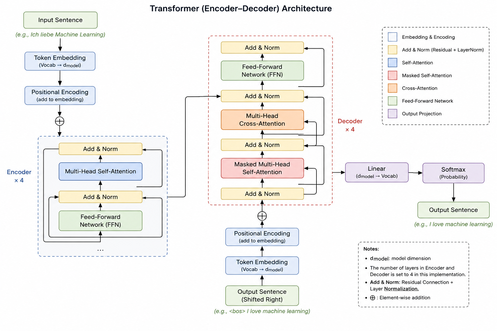
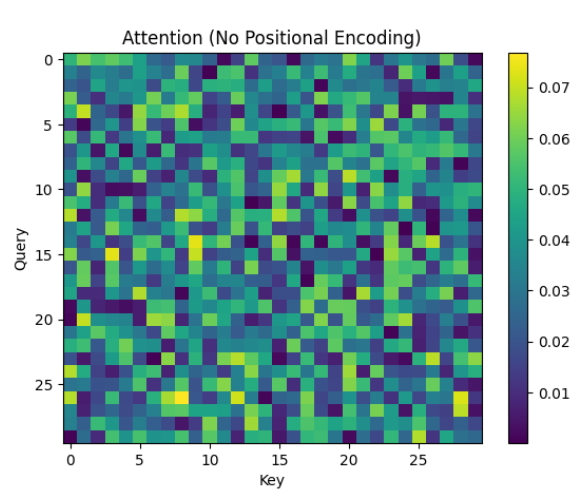
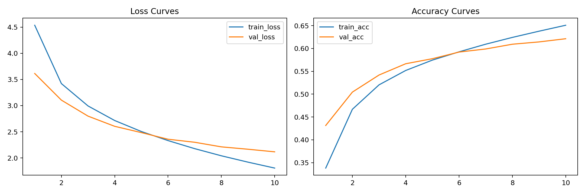
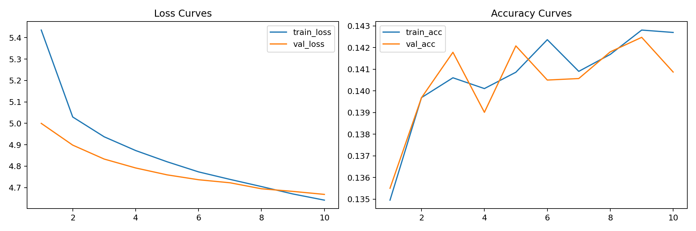

````md
# 《Attention Is All You Need》(2017) 复现与模块必要性实验报告（Homework 4）

## 1. 作业要求对应关系

本报告严格对应作业两项要求：

1. **阅读并复现经典论文《Attention Is All You Need》**：
   在 Multi30k de→en 翻译任务上，实现并训练 Encoder-Decoder Transformer（多头注意力、FFN、残差、LayerNorm、位置编码、masked decoding）。

2. **通过实验理解 Transformer 各模块必要性**：
   本项目完成了以下两类模块消融实验：

   - 作业2.1：位置编码（Position Encoding）
     - `sinusoidal`
     - `learned absolute`
     - `none`

   - 作业2.3：ResNet 式残差连接（Residual Connection）
     - `residual on`
     - `residual off`

---

# 2. Transformer 原理论文核心思想与整体架构

## 2.1 Transformer 的核心思想

传统 Seq2Seq 模型主要基于 RNN/LSTM，通过时间递归方式处理序列：

```text
h1 → h2 → h3 → h4
````

这种结构存在：

* 难以并行；
* 长距离依赖困难；
* 梯度传播路径过长等问题。

Transformer 的核心思想是：

> 使用 Self-Attention 替代循环结构，使任意 token 之间能够直接建立联系。

因此：

```text
token_i ↔ token_j
```

之间的依赖路径长度恒为 1，从而显著增强长距离依赖建模能力，并提升 GPU 并行效率。

---

## 2.2 Transformer 整体结构

Transformer 采用 Encoder-Decoder 架构：

```text
Input Tokens
↓
Embedding
↓
Positional Encoding
↓
Encoder Stack
↓
Decoder Stack
↓
Linear + Softmax
↓
Output Tokens
```

其中：

* Encoder 负责源语言上下文语义编码；
* Decoder 负责自回归生成目标序列；
* Cross-Attention 建立源语言与目标语言之间的语义对齐关系。

### Transformer 整体结构图（待补充）



---

## 2.3 Scaled Dot-Product Attention

Transformer 的核心计算为：

\mathrm{Attention}(Q,K,V)=\mathrm{softmax}\left(\frac{QK^T}{\sqrt{d_k}}\right)V

其中：

* Query（Q）：当前 token 的查询表示；
* Key（K）：所有 token 的匹配特征；
* Value（V）：对应 token 的语义信息。

Attention 本质上是在计算：

> 当前 token 应该关注序列中的哪些 token。

其中：

[
QK^T
]

表示 token 两两之间的相关性。

而：

[
\frac{1}{\sqrt{d_k}}
]

用于控制数值范围，避免 softmax 进入梯度饱和区域。

---

## 2.4 Multi-Head Attention

Transformer 并非只进行一次 Attention，而是采用多头机制：

\mathrm{MultiHead}(Q,K,V)=\mathrm{Concat}(head_1,\dots,head_h)W_O

不同 attention head 会学习不同类型的关系：

* 局部语法；
* 长距离依赖；
* 词法对齐；
* 语义关联等。

多头机制使模型能够在不同子空间中同时学习多种特征模式。

---

## 2.5 Position Encoding

由于 Self-Attention 本身不包含顺序信息，因此 Transformer 必须额外引入位置编码。

原论文采用固定正弦位置编码：

PE(pos,2i)=\sin\left(\frac{pos}{10000^{2i/d}}\right)

PE(pos,2i+1)=\cos\left(\frac{pos}{10000^{2i/d}}\right)

其中：

* `pos` 表示 token 在序列中的位置；
* `i` 表示 embedding 维度索引。

位置编码会与 token embedding 相加：

```text
Embedding + Positional Encoding
```

从而为 Attention 提供序列位置信息。

---

## 2.6 为什么 Transformer 必须使用位置编码

Self-Attention 本质上只计算 token 两两之间的相似度：

```text
QK^T
```

其本身并不关心 token 的位置索引。

因此：

```text
ABC
CBA
```

在不加入位置编码时，Attention 看到的只是 token 集合，而非序列结构。

即：

> Self-Attention 天然是 permutation-invariant（排列不变）的。

因此：

Transformer 必须通过 Position Encoding 提供“顺序归纳偏置（sequential inductive bias）”，才能正确建模语言中的语序关系。

---

## 2.7 Residual Connection（ResNet 结构）

Transformer 每个子层均采用：

```text
Add & Norm
```

其核心形式为：

x_{l+1}=x_l+F(x_l)

即：

```text
输入 + 子层输出
```

Residual Connection 的核心作用包括：

* 改善梯度传播；
* 避免深层表示退化；
* 稳定深层网络训练；
* 保留 identity mapping。

即使：

```text
F(x)
```

学习失败，网络仍然能够退化为恒等映射：

```text
x_{l+1} ≈ x_l
```

从而避免深层 Transformer 在训练过程中出现表示崩塌问题。

---

# 3. 项目代码结构与各模块作用梳理

## 3.1 数据与预处理

* `utils/tokenizer.py`

  * 实现 `BasicTokenizer`
  * 负责分词、词表构建及 `BOS/EOS/PAD/UNK` 处理。

* `utils/dataset.py`

  * 读取本地 Multi30k 数据；
  * 构建 `TranslationDataset`；
  * 完成 batch padding 与张量化。

* `data/*.de, *.en`

  * 德英平行语料文件。

---

## 3.2 模型实现（Transformer 复现）

* `model/attention.py`

  * 实现 Scaled Dot-Product Attention 与 Multi-Head Attention；
  * 返回 attention map 用于可视化。

* `model/encoder.py`

  * EncoderLayer/Encoder 堆叠；
  * 包含：

    * self-attention
    * FFN
    * residual
    * LayerNorm

* `model/decoder.py`

  * DecoderLayer/Decoder 堆叠；
  * 包含：

    * masked self-attention
    * cross-attention
    * FFN
    * residual
    * LayerNorm

* `model/transformer.py`

  * Transformer 总装模块：

    * Embedding
    * Positional Encoding
    * Encoder
    * Decoder
    * Linear Projection

---

## 3.3 训练、评估与实验脚本

* `train.py`

  * 模型训练入口；
  * 输出并记录：

    * train/val loss
    * train/val accuracy
  * 保存最佳 checkpoint。

* `eval.py`

  * greedy decode；
  * BLEU 评估；
  * 输出 JSON 指标与样例。

* `experiments/no_pe.py`

  * 自动化位置编码实验。

* `experiments/ablation_residual.py`

  * 自动化 residual 消融实验。

* `visualize_attention.py`

  * 绘制：

    * attention heatmap
    * BLEU 柱状图
    * loss 曲线图

---

# 4. 实验设置

## 4.1 数据集与任务

* 数据集：Multi30k
* 任务：de→en 机器翻译

数据划分：

| Split |     数量 |
| ----- | -----: |
| Train | 12,000 |
| Valid |  1,000 |
| Test  |  1,000 |

---

## 4.2 模型配置

| 参数             | 设置   |
| -------------- | ---- |
| Encoder Layers | 4    |
| Decoder Layers | 4    |
| Heads          | 4    |
| d_model        | 256  |
| Batch Size     | 64   |
| Epochs         | 10   |
| Optimizer      | Adam |
| Learning Rate  | 2e-4 |

---

## 4.3 控制变量说明

为保证消融实验可信度，所有实验统一：

* random seed；
* optimizer；
* batch size；
* epoch；
* vocab；
* decoding 策略；
* 数据划分。

因此：

> 性能差异可主要归因于目标模块本身，而非训练随机性或实验配置差异。

---

## 4.4 复现规模说明

本项目重点在于：

> 验证 Transformer 各模块的作用机制与必要性。

因此：

* 使用较小规模 Multi30k 数据集；
* 使用轻量 Transformer 配置；
* 采用 10 epochs 训练。

其目标并非追求工业级翻译性能，而是保证：

* 消融实验可控；
* 训练成本合理；
* 结果具有可解释性。

---

# 5. 实验一：位置编码必要性（sinusoidal vs learned vs none）

## 5.1 实验动机

论文指出：

> Attention 本身不编码顺序，因此必须显式注入位置信息。

本实验比较：

* 固定正弦位置编码；
* 可学习绝对位置编码；
* 无位置编码。

---

## 5.2 实验结果

| PE 模式      | train_loss@10 | train_acc@10 | val_loss@10 | val_acc@10 |  test BLEU |
| ---------- | ------------: | -----------: | ----------: | ---------: | ---------: |
| sinusoidal |        1.8012 |       0.6512 |      2.1028 |     0.6263 |     0.2452 |
| learned    |        1.8470 |       0.6455 |      2.1514 |     0.6186 | **0.2532** |
| none       |        2.0245 |       0.6023 |      2.4052 |     0.5259 |     0.0001 |

---

## 5.3 现象分析

### （1）无位置编码导致“会选词，不会排词序”

`none` 的 train acc 仍达到约 0.60，但 BLEU≈0。

说明模型：

* 能学习局部词汇统计；
* 能记住高频词对应关系；

但：

* 无法建立句法顺序；
* 无法形成合理语序；
* 无法生成正确短语结构。

因此：

> Transformer 若缺少 Position Encoding，将退化为“弱语序模型”。

---

### （2）sinusoidal 与 learned 都能有效工作

两者 loss/acc 接近。

说明：

> 二者都成功为 Attention 提供了有效的位置信息。

---

### （3）本次小规模数据上 learned 略优

本实验中：

```text
learned BLEU > sinusoidal BLEU
```

可能原因：

* learnable PE 能更贴合当前语料句长分布；
* 参数能够适应当前数据统计特性。

---

## 5.4 结论

位置编码的核心作用是：

> 为 Self-Attention 提供序列顺序约束。

缺失位置编码时：

* Transformer 无法区分 token 的顺序；
* Attention 无法建立稳定语法结构；
* 翻译能力显著崩溃。

---

# 6. 实验二：ResNet 式残差连接必要性（on vs off）

## 6.1 实验动机

Transformer 每个子层均采用：

```text
Add & Norm
```

其中 residual connection 是深层训练稳定性的关键来源。

因此本实验对比：

* residual ON
* residual OFF

两种配置。

---

## 6.2 实验结果

| 残差配置         | epoch1 train_loss / acc | epoch10 train_loss / acc | epoch10 val_loss / acc | test BLEU |
| ------------ | ----------------------- | ------------------------ | ---------------------- | --------: |
| residual ON  | 4.5351 / 0.3380         | 1.8064 / 0.6508          | 2.1168 / 0.6213        |    0.2308 |
| residual OFF | 5.4356 / 0.1350         | 4.6411 / 0.1427          | 4.6679 / 0.1409        |    0.0000 |

---

## 6.3 现象分析

### （1）关闭 residual 后训练几乎停滞

Residual OFF：

```text
5.4356 → 4.6411
```

loss 下降极其缓慢。

表现出：

* 深层优化困难；
* 表示学习能力下降；
* 收敛速度显著变慢。

---

### （2）梯度传播路径被破坏

train/val acc 长期停留在：

```text
≈ 0.14
```

说明：

* 梯度难以稳定传播；
* 深层表示难以更新；
* 网络趋于训练失败。

---

### （3）最终翻译能力崩溃

BLEU≈0。

并触发：

```text
4-gram overlap warning
```

说明：

模型输出已基本失去可用翻译能力。

---

## 6.4 结论

Residual Connection 的核心作用包括：

* 改善梯度传播；
* 保留 identity mapping；
* 稳定深层训练；
* 提升最终收敛性能。

因此：

> 不采用 ResNet 式结构会导致深层 Transformer 难以有效训练。

---

# 7. 可视化结果说明

## 7.1 Transformer Attention Heatmap


热力图显示：

* Decoder 在生成目标词时；
* 会对对应源语言词产生明显关注。

说明：

Cross-Attention 已学习到跨语言词对齐关系。

---

## 7.2 Transformer 架构图（待补充）


---

## 7.3 Position Encoding 可视化（待补充）



---

## 7.4 Residual ON/OFF 训练曲线





曲线与实验结果一致：

* residual ON 时稳定收敛；
* residual OFF 时训练停滞。

---

## 7.5 BLEU 柱状图


柱状图直观说明：

* Position Encoding 对 Transformer 至关重要；
* Residual Connection 是深层训练稳定性的关键。

---

# 8. 实验总结与反思

## 8.1 对 Transformer 的理解从“结构”推进到“机制”

复现与消融实验表明：

* Position Encoding
* Residual Connection

并非简单经验技巧。

而是：

> Transformer 能够有效工作的必要条件。

---

## 8.2 Token Accuracy 的局限性

仅观察 token accuracy 会误判模型效果。

例如：

* no-PE 模型仍有一定 accuracy；
* 但 BLEU 几乎为 0。

说明：

> 翻译任务必须采用序列级指标（如 BLEU）评估生成质量。

---

## 8.3 实验设计的收获

本实验进一步理解了：

> 控制变量对于模块消融实验的重要性。

若：

* batch size；
* optimizer；
* decoding；
* 数据划分

发生变化，则难以将性能差异归因于单一模块。

---

## 8.4 局限性与未来改进方向

当前实验仍存在：

* 数据规模较小；
* epoch 较少；
* greedy decoding 较简单等局限。

未来可进一步研究：

* relative positional encoding；
* RoPE / ALiBi；
* pre-norm vs post-norm；
* beam search decoding；
* FlashAttention 等改进方向。

---

# 9. 最终结论

本项目完成了：

* 《Attention Is All You Need》核心架构复现；
* Transformer Encoder-Decoder 翻译系统实现；
* 多组模块必要性消融实验。

实验结果验证：

1. Position Encoding 是 Transformer 建模语序的必要条件；
2. Residual Connection 是深层 Transformer 稳定训练的关键；
3. Attention 本身并不具备序列顺序归纳偏置；
4. Transformer 的有效性来源于：

   * Self-Attention 的全局依赖建模能力；
   * Position Encoding 的顺序建模能力；
   * Residual 的深层优化能力。

```
```
