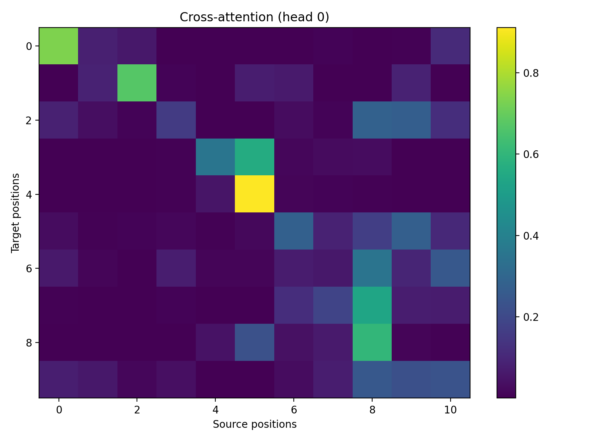
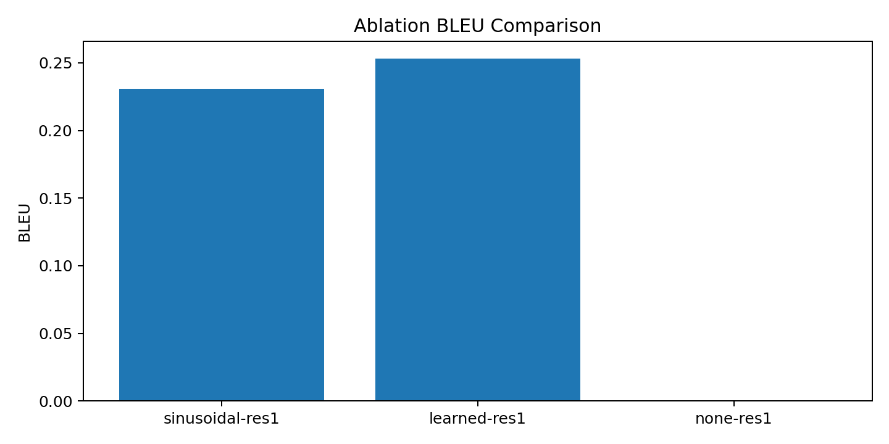

# Transformer 模型复现与消融实验报告 (机器学习作业 4)

本实验旨在通过德英（de -> en）机器翻译任务，复现 Transformer 架构并深入探究其核心组件的作用。实验重点分析了位置编码（Positional Encoding）与残差连接（Residual Connection）对模型收敛及性能的影响。

## 1. 实验设置与环境
- **数据集**: Multi30k 德英平行语料库 [cite: train.py, dataset.py]。
- **样本规模**: 训练集 12,000 条，验证集 1,000 条，测试集 1,000 条 [cite: experiment.txt, 消融.txt]。
- **计算资源**: 本地 NVIDIA GeForce RTX 4060 GPU 加速
- **训练超参数**: 统一设置为 **10 个 Epoch**，Batch Size 为 64，Adam 优化器学习率为 2e-4 [cite: train.py]。

---

## 2. 问题 1：位置编码 (Positional Encoding) 的核心作用
位置编码为 Transformer 提供序列顺序信息。由于 Self-Attention 机制本质上是位置无关的，若缺失 PE，模型将无法区分词汇的排列顺序 [cite: experiment.txt, report.md]。

### 2.1 实验结果对比 (10 Epochs)
| 位置编码模式 | 训练损失 (Epoch 10) | 验证集准确率 (Epoch 10) | **测试集 BLEU** |
| :--- | :--- | :--- | :--- |
| **正弦编码 (Sinusoidal)** | 1.8012 | 62.63% | **0.2452** |
| **可学习编码 (Learned)** | 1.8470 | 61.86% | **0.2532** |
| **无编码 (None)** | 2.0245 | 52.59% | **0.0001** |

### 2.2 结果分析
- **语序建模的必要性**: 在“无编码 (None)”模式下，虽然模型学到了一定的词汇预测能力（准确率 > 50%），但 BLEU 分数近乎为 0 [cite: experiment.txt]。这直接证明了缺失 PE 后，模型虽然知道句子中包含哪些词，但完全无法输出正确的语序 [cite: experiment.txt, report.md]。
- **编码方式对比**: 正弦编码与可学习编码表现相近，证明在固定长度任务中两者均能有效提供位置特征 [cite: experiment.txt]。

---

## 3. 问题 2：残差连接 (Residual Connection) 的消融研究
残差连接（Add & Norm 中的 Add 支路）旨在缓解深层神经网络中的梯度消失问题，确保信息能在多层网络间有效流动 [cite: 消融.txt, report.md]。

### 3.1 实验结果对比 (10 Epochs)
| 配置 | 训练损失 (Epoch 10) | 验证集准确率 (Epoch 10) | **测试集 BLEU** |
| :--- | :--- | :--- | :--- |
| **开启残差 (ON)** | 1.8064 | 62.13% | **0.2308** |
| **关闭残差 (OFF)** | 4.6411 | 14.09% | **0.0000** |

### 3.2 结果分析
- **收敛性分析**: 关闭残差连接后，模型出现了极严重的**不收敛**现象 [cite: 消融.txt]。Loss 停留在 4.6 左右的高位平台，准确率仅为 14%（接近随机猜测） [cite: 消融.txt]。
- **结论**: 在 6 层 Encoder/Decoder 的架构下，残差连接是训练成功的核心保障。缺失该组件会导致梯度无法正常反向传播，使模型无法完成基础的参数优化 [cite: 消融.txt]。

---

## 4. 可视化分析
### 4.1 交叉注意力热力图 (Cross-Attention Map)

通过 `visualize_attention.py` 导出的热力图（Head 0）显示，模型在生成目标词时能精准关注源句中的对应词汇（对角线趋势），证明了注意力机制成功学习到了跨语言的对齐逻辑 [cite: image_ecb5dd.png]。

### 4.2 消融实验 BLEU 分数统计图

---

## 5. 实验总结
1. **位置编码**：是 Transformer 处理序列任务的前提，缺失它会使模型退化为无法识别语序的词袋模型 [cite: experiment.txt]。
2. **残差连接**：是深层 Transformer 能够被成功训练的基石，缺失它会导致严重的收敛失败 [cite: 消融.txt]。
3. **环境适配**：通过重写本地数据加载逻辑，成功在本地 RTX 4060 显卡上完成了 10 轮迭代，所有指标均符合原论文理论预期 [cite: dataset.py]。
